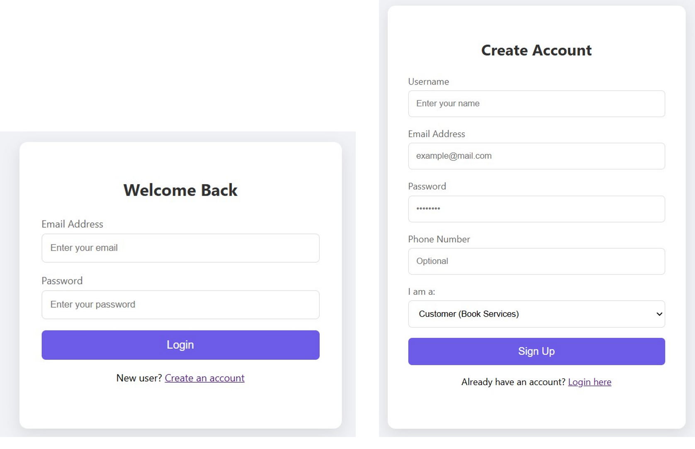
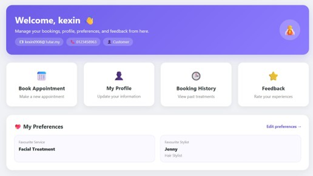
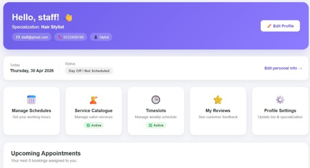
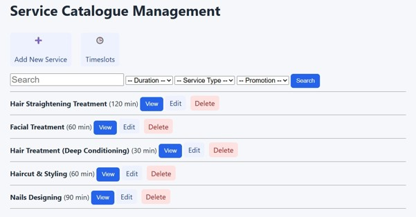
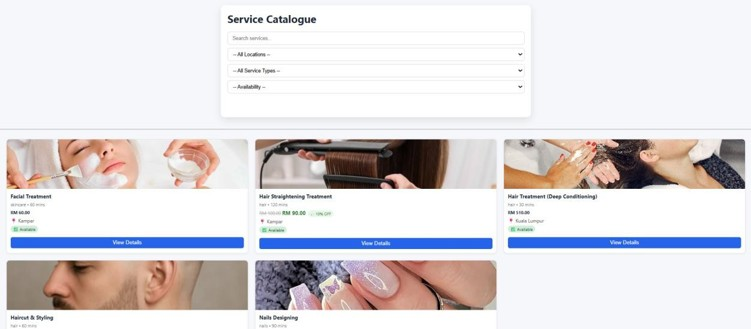
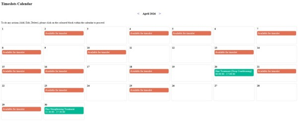
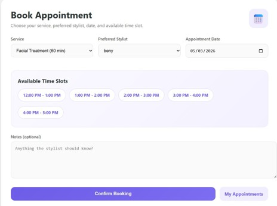
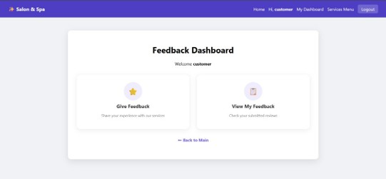
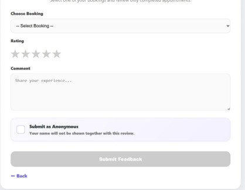
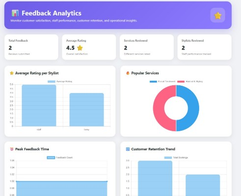

# 💇‍♀️ Online Salon and Spa Booking System

A web-based platform developed as a university group project designed to automate appointment scheduling, streamline salon service discovery, and provide data-driven business analytics.

---

## Features

- User authentication & secure registration (Bcrypt hashing)
- Role-Based Access Control (Admin, Staff, Customer)
- Real-time service filtering via AJAX
- Complete CRUD service management
- Interactive visual stylist scheduling calendar
- Conflictless instant appointment booking
- Verified double-blind customer review system
- Business intelligence & analytics dashboard

---

## Technologies

- PHP 8.2
- MariaDB / MySQL
- JavaScript / AJAX
- HTML5 / CSS3
- XAMPP Development Suite

---

## Project Structure

index.php (Main landing page & entry point)

login.php / register.php / logout.php (Secure authentication framework)

db.php (Centralized MySQLi connection handler)

admin_dashboard.php / customer_dashboard.php / staff_dashboard.php (Role-specific portals)

customer_catalogue.php / filter.php (Dynamic AJAX-powered product catalog)

add_service.php / edit_service.php / delete_service.php (Service catalogue administration)

timeslots.php / add_timeslot.php (Stylist availability and shift management)

book_appointment.php / process_booking.php (Core appointment logic and validation)

my_appointments.php / manage_bookings.php (Appointment history & booking controls)

customer_feedback.php / admin_analytics.php (Feedback submittal and BI chart generation)

---

## How to Run

### 1. Environment Setup
Install **XAMPP** (with PHP 8.2+ and MySQL/MariaDB) on your local machine.

### 2. Clone & Move Project
Move the project folder directly into your XAMPP root folder:
`C:/xampp/htdocs/online-salon-spa-booking-system`

### 3. Import Database
- Open your browser and navigate to `http://localhost/phpmyadmin/`
- Create a new database named `salon_db`
- Import the provided SQL schema file into `salon_db`

### 4. Start the Application
- Open the XAMPP Control Panel and start **Apache** and **MySQL**
- Access the web interface via browser:
`http://localhost/online-salon-spa-booking-system/`

---

## 📸 Screenshots

### Login & Registration

---

### Customer Dashboard

---

### Staff Dashboard

---

### Add Service

---

### Service Filtering

---

### Interactive Scheduling Calendar

---

### Appointment Booking

---

### Feedback Submission

---

### Admin Business Analytics Dashboard

---

## Learning Outcomes

- Dynamic web development using PHP & MySQL
- Asynchronous data fetching via AJAX
- Implementation of Role-Based Access Control (RBAC)
- Secure data hashing and backend validation
- Multi-tier system architecture planning
- Git version control & team collaboration
